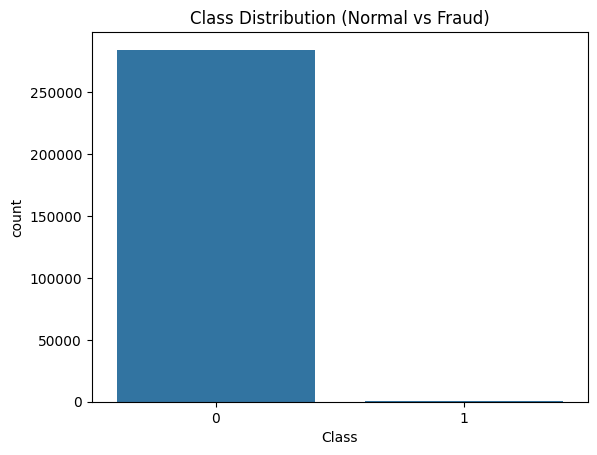
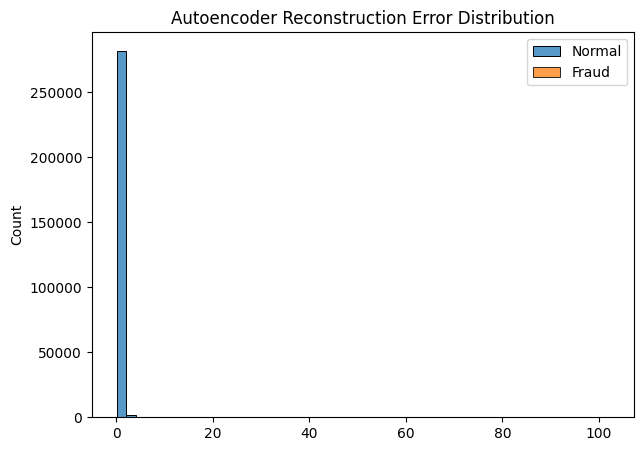
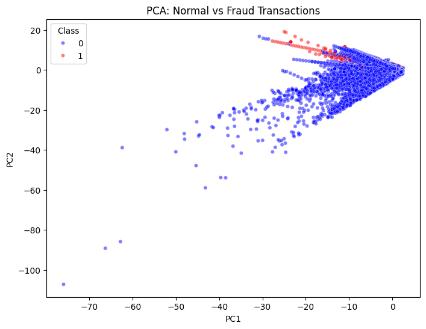

# 💳 Credit Card Fraud Detection

[](https://www.python.org/)
[](https://www.tensorflow.org/)
[](https://scikit-learn.org/)

Detected fraud transactions with Isolation Forest (Recall 0.82) and Autoencoder (Precision 0.91) on a 284k transaction dataset.

---

## 📌 Overview
The objective of this project is to detect fraudulent credit card transactions using Python. Fraud transactions are extremely rare, making the dataset highly imbalanced. This project demonstrates the use of **unsupervised anomaly detection techniques** to identify fraud patterns and visualize anomalies for better interpretability.

---

## 📂 Dataset
The project uses the **Credit Card Fraud Detection Dataset** from Kaggle:
- Source: [Kaggle – Credit Card Fraud Detection](https://www.kaggle.com/datasets/mlg-ulb/creditcardfraud)
- Number of transactions: 284,807
- Features: 
  - `Time` – seconds elapsed between transactions
  - `Amount` – transaction amount
  - `V1` to `V28` – anonymized PCA features
  - `Class` – target variable (0 = Normal, 1 = Fraud)
- Fraud cases: 492 (~0.17%)

---

## 🧠 Models Used
### 1️⃣ Isolation Forest
- Isolation Forest Recall (Fraud): 0.82
- Unsupervised tree-based anomaly detection algorithm
- Isolates outliers by partitioning data using random trees
- Flags transactions as anomalies (fraud) without using class labels

### 2️⃣ Autoencoder
- Autoencoder Precision (Fraud): 0.91
- Neural network-based unsupervised model
- Learns to reconstruct normal transaction patterns
- Transactions with **high reconstruction error** are flagged as fraud

---

## 🔧 Data Preprocessing
- Scaled `Amount` and `Time` features using `StandardScaler`
- Kept PCA features (V1–V28) as-is
- Prepared feature matrix `X` and target vector `y`
- Trained models using only normal transactions for unsupervised learning

---

## 📈 Evaluation Results
- Evaluated using **confusion matrix** and **classification report**
- Key metric focus: **Recall for fraud class** (class 1)
- Isolation Forest detected anomalies effectively, Autoencoder showed higher precision in reconstructing normal patterns
- Both models handle highly imbalanced datasets without oversampling

---

## 📊 Visualizations

### 1️⃣ Class Distribution
Shows severe imbalance between normal and fraud transactions



### 2️⃣ Reconstruction Error Histogram (Autoencoder)
Highlights difference in reconstruction errors between normal and fraud transactions



### 3️⃣ PCA Scatter Plot
Visualizes fraud (outliers) and normal transactions in 2D



### 4️⃣ Autoencoder Predicted Anomalies (PCA)
Shows model’s prediction overlay on PCA-reduced data

.png)

---

## ⚙️ How to Run
1. Install dependencies:

```bash
pip install -r requirements.txt
```

2. Open fraud_detection.ipynb in Jupyter Notebook

3. Run all cells sequentially to reproduce results and visualizations.

---

## 📊 Tech Stack
- **Languages:** Python 3.11  
- **Data Analysis & Visualization:** Pandas, NumPy, Matplotlib, Seaborn  
- **Machine Learning:** Scikit-learn (Isolation Forest, PCA)  
- **Deep Learning:** TensorFlow / Keras (Autoencoder)  
- **Environment:** Jupyter Notebook, VS Code  
- **Version Control:** Git / GitHub

---

## 🏁 Conclusion
- Built an end-to-end credit card fraud detection system using Isolation Forest and Autoencoder
- Handled highly imbalanced dataset and scaled features professionally
- Visualized anomalies with PCA for clear insights
- Achieved high recall for fraud detection, demonstrating strong data analysis, machine learning, and deep learning skills
- Fully reproducible and ready for portfolio/GitHub showcase

---

## 👤 Author
**Shadan Tech**   
_Data Analyst_

🔗 [LinkedIn Profile](http://www.linkedin.com/in/shadantech)  
🔗 [Tableau Public Profile](https://public.tableau.com/app/profile/shadan.sarfaraz/vizzes)
🔗 [Newsletter](https://shadantech.substack.com/)

---

## ⭐ Show Your Support
If you found this project insightful, give it a **⭐ Star** on GitHub — it helps others discover it too!  
Connect on **LinkedIn** for more Power BI, Tableau, and Data Analytics projects.